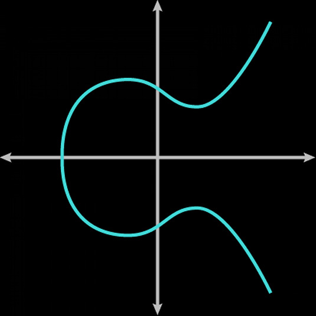
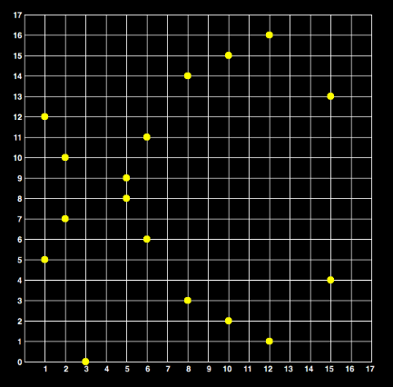
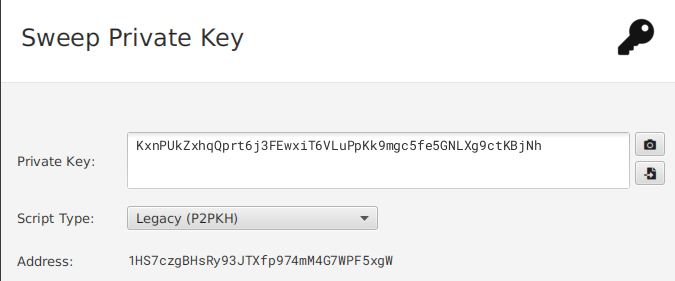

+++
title = "From Dice to Address"
description = "Creating a Bitcoin address from scratch"
date = "2024-03-19"
template = "blog/blog.html"
tags = ["bitcoin", "ecc"]
+++



# From Dice to Address



Wan't to create a Bitcoin address from scratch? Look no further!

## Generating Entropy

Entropy, in the thermodynamic sense, relates to the available energy
a system has that can do be transformed into heat or useful work. A system
with low entropy is very ordered, and it's energy is very available;
a system with high entropy is very unordered, and it's
energy is very unavailable.

Entropy, in the cryptographic sense, is the measure of how unpredictable
a sequence of bits is. In our case, we want random, high entropy private
key, so much so that guessing it is astronomically, almost
physically, [impossible](https://www.youtube.com/watch?v=S9JGmA5_unY).

The first step is to generate the entropy for the private key. To do this,
we need a source of random data. The best way to do this is to sample
random/chaotic events, like electromagnetic radiation, a noisy microphone,
or radioactive decay. The linux kernel uses device timings, and
keyboard/mouse input as entropy sources for `/dev/random`. You could flip
a coin just as well; we'll use dice throws `🎲`.

To create a key with enough entropy (ie: hard to guess),
we want around _256 bits_. Since a dice has 6 possible values,
a single throw contributes $\log_26 \approx 2.58$ bits of entropy,
so from 100 we can source a little over _256 bits_.
You should get something like this:

```
1542263214
2451632542
1341224566
1452214365
4632152465
2345126456
2314516421
2134514621
1645164216
2146516424
```

## Mapping Entropy to BIP39 Words

Ok, so how do we go from 100 digits to 24 words? Here's the process:

First, calculate the _SHA256_[^sha256] hash of this number:

[^sha256]:
    `SHA256` is a [cryptographic hasing function (CHF)](https://en.wikipedia.org/wiki/Cryptographic_hash_function)
    of the [SHA-2](https://en.wikipedia.org/wiki/SHA-2) family. CHFs basically map of an arbitrary binary string
    to a binary string with a fixed size of $n$ bits respecting some special properties desirable for a
    cryptographic application: (1) The output of the function must follow a homogenous distribution, (2) finding a preimage is intractable
    (i.e.: Computing the input, given the output is pratically impossible. This is why SHA256 is called a _One-Way Function_.),
    and (3) finding a collision is intractable (i.e.: finding different preimages that yield the same result is pratically impossible.)
    If you want to understand how SHA256 works in a visual way, see [sha256algorithm.com](https://sha256algorithm.com/).
    See also my C implementation [here](https://github.com/luisschwab/sha256.c).


```py
from hashlib import sha256

entropy = '1542263214245163254213412245661452214365463215246523451264562314516421213451462116451642162146516424'

digest = sha256(entropy.encode()).hexdigest()

'''
cd2ea5df3ecccad86ea9d41c9418cb302ad6e219f20561d10bee3a806ffb93c8
'''
```

Then convert the hex digest into binary:

```py
digest = 'cd2ea5df3ecccad86ea9d41c9418cb302ad6e219f20561d10bee3a806ffb93c8'

binary = bin(int(digest, 16))

'''
11001101001011101010010111011111
00111110110011001100101011011000
01101110101010011101010000011100
10010100000110001100101100110000
00101010110101101110001000011001
11110010000001010110000111010001
00001011111011100011101010000000
01101111111110111001001111001000
'''
```

The BIP39 wordlist has 2048 words, so you need $\log_{2}{2048} = 11$ bits
to index a word. We can make 23 words with 256 bits and have 3 bits left.
We still need 8 bits more; where's the rest?

The last 8 bits are a checksum[^checksum]!

[^checksum]:
    "A checksum is a small-sized block of data derived from another block of digital
    data for the purpose of detecting errors that may have been introduced during its
    transmission or storage." This is useful because the checksum will be invalid if
    if you use the wrong word. As a consequence, this implies that most word
    combinations are invalid (i.e.: you can't randomly pick 24 words).

Let's separate the digest bits into _11 bit_ words[^word] and get the corresponding
words from the [BIP39 wordlist](https://github.com/bitcoin/bips/blob/master/bip-0039/english.txt)[^index].

[^word]: Don't mistake binary words with english words!

[^index]: Remember to add 1 to the numbers below, since the list from the link above is not 0-indexed.


```shell
 1: 11001101001 -> 1641 -> snake
 2: 01110101001 -> 937  -> inside
 3: 01110111110 -> 958  -> jelly
 4: 01111101100 -> 1004 -> laugh
 5: 11001100101 -> 1637 -> smile
 6: 01101100001 -> 865  -> history
 7: 10111010101 -> 1493 -> rival
 8: 00111010100 -> 468  -> dentist
 9: 00011100100 -> 228  -> broken
10: 10100000110 -> 1286 -> patch
11: 00110010110 -> 406  -> crazy
12: 01100000010 -> 770  -> gate
13: 10101101011 -> 1387 -> pulp
14: 01110001000 -> 904  -> illegal
15: 01100111110 -> 830  -> guitar
16: 01000000101 -> 517  -> doll
17: 01100001110 -> 782  -> gift
18: 10001000010 -> 1090 -> marriage
19: 11111011100 -> 2012 -> wine
20: 01110101000 -> 936  -> insect
21: 00000110111 -> 55   -> alone
22: 11111101110 -> 2030 -> worry
23: 01001111001 -> 633  -> execute
24: 000________ -> _    -> _
```

Now, let's calculate the checksum. We have bits `000` left from
the process and we need 8 more to make 11. To get it, we hash our
entropy digest from above using _SHA256_ again. Then get the first
byte of this new digest and append them to the sequence:

```py
digest = 'cd2ea5df3ecccad86ea9d41c9418cb302ad6e219f20561d10bee3a806ffb93c8'

digest2 = sha256(bytes.fromhex(digest))

'''
4f91e4a416465d7bbdc7c6dd105aaabfce74fe2c279efdb24902ce16b0fc81e4
'''
```

The first byte of the new digest is `4F`. Converting this to binary yields
`01001111`. Appending this to `000` yields `00001001111`, or $ 79_{10}$.
This corresponds to the word _antique_ in the wordlist. Our BIP39 mnemonic will then be:

```console
 1: 11001101001 -> 1641 -> snake
 2: 01110101001 -> 937  -> inside
 3: 01110111110 -> 958  -> jelly
 4: 01111101100 -> 1004 -> laugh
 5: 11001100101 -> 1637 -> smile
 6: 01101100001 -> 865  -> history
 7: 10111010101 -> 1493 -> rival
 8: 00111010100 -> 468  -> dentist
 9: 00011100100 -> 228  -> broken
10: 10100000110 -> 1286 -> patch
11: 00110010110 -> 406  -> crazy
12: 01100000010 -> 770  -> gate
13: 10101101011 -> 1387 -> pulp
14: 01110001000 -> 904  -> illegal
15: 01100111110 -> 830  -> guitar
16: 01000000101 -> 517  -> doll
17: 01100001110 -> 782  -> gift
18: 10001000010 -> 1090 -> marriage
19: 11111011100 -> 2012 -> wine
20: 01110101000 -> 936  -> insect
21: 00000110111 -> 55   -> alone
22: 11111101110 -> 2030 -> worry
23: 01001111001 -> 633  -> execute
24: 00001001111 -> 79   -> antique
```

Now, this sequence of 24 words, called a _Mnemonic_[^mnemonic] encodes the
entirety of our 256 bit private key (with 256 bits of entropy) in a
human-readable format.

[^mnemonic]:
    Most people (mistakenly!) refer to the _Mnemonic_ as _Seed_.
    The _Seed_ is what comes out of the [PBKDF2](https://en.wikipedia.org/wiki/PBKDF2)
    function, which uses the _Mnemonic_ as one of it's inputs.
    See [learnmeabitcoin.com/technical/keys/hd-wallets/mnemonic-seed/](technical/keys/hd-wallets/mnemonic-seed/)
    to learn more.

You can check that you did everything correctly with
this utility made by Coinkite: [`rolls.py`](https://coldcard.com/docs/rolls.py).

You might be wondering: isn't the private key _264 bits_ long,
since $24 \cdot 11 = 264$? No, because the last _8 bits_ are derived
from the previous __256 bits__, so they don't encode any new information.
This same principle is used in BIP32 child key derivation: a
single, **master**, private key has the information to create virtually
infinite child keys.

## Elliptic Curve Cryptography 101

Bitcoin uses this thing called Elliptic Curve Cryptography.
Basically, an elliptic curve is a curve described by an equation
of this form:

$$ y^2 = x^3 + ax + b $$

where $a$ and $b$ are integers. A curve of this family looks like this:



Bitcoin uses an elliptic curve called _secp256k1_[^secp256k1].
It defines coefficients for the curve, where the _Generator Point_ ($G$) is,
and the size of the [_Finite Field_](https://en.wikipedia.org/wiki/Finite_field)
over which operations are done. They are:

[^secp256k1]:
    "`secp256k1` refers to the parameters of the elliptic curve used in Bitcoin's public-key cryptography,
    and is defined in [Standards for Efficient Cryptography (SEC)](http://www.secg.org/sec2-v2.pdf).
    Currently Bitcoin uses secp256k1 with the
    ECDSA algorithm [after Taproot (circa 2021), Bitcoin implements the Schnorr algorithm],
    though the same curve with the same public/private keys can be used in some other algorithms such as Schnorr."

```console
p = FFFFFFFFFFFFFFFFFFFFFFFFFFFFFFFFFFFFFFFFFFFFFFFFFFFFFFFEFFFFFC2F
  = 2^256 - 2^32 - 2^9 - 2^8 - 2^7 - 2^6 - 2^4 - 1

a = 0x00

b = 0x07

G = 0x0279BE667EF9DCBBAC55A06295CE870B07029BFCDB2DCE28D959F2815B16F81798 (compressed generator point)

n = FFFFFFFFFFFFFFFFFFFFFFFFFFFFFFFEBAAEDCE6AF48A03BBFD25E8CD0364141 (order n of G)
```

Then, _secp256k1_'s EC equation becomes

$$ y^2 = x^3 + 7 $$

Since the curve is over a finite field, it ceases being continuous
and becomes discrete. It actually looks like this:



When doing finite field math, all operations are done _modulo p_,
so that we don't overflow out of the field.

## Finding the Point, or Public Key

So we have our 256 bit private key, and the _secp256k1_
curve. How do we derive a public key from that?

A public key is just a point on this curve. We get a Public Key point, $\mathbb{P}$,
by multiplying the generator point $G$ with the private key $k$ (in our case, the 24*11 bits
that we derived from entropy), like this:

$$ P = k * G $$

In python, this is done like so:

```py
import coincurve

# field size
p = int('FFFFFFFFFFFFFFFFFFFFFFFFFFFFFFFFFFFFFFFFFFFFFFFFFFFFFFFEFFFFFC2F', 16)

# private key derived from dice entropy + checksum
k = \
'''
1100110100101110101001
0111011111001111101100
1100110010101101100001
1011101010100111010100
0001110010010100000110
0011001011001100000010
1010110101101110001000
0110011111001000000101
0110000111010001000010
1111101110001110101000
0000011011111111101110
0100111100100001001111
'''.replace('\n', '')

# convert k to int, keep k inside the field
k = int(k, 2) % p
'21099461583037868212411742703127280085327935027273309817117142164330199307948'

# generator point
G = coincurve.PrivateKey.from_int(1).public_key

# public key point (k*G)
P = G.multiply((k).to_bytes(32, 'big'))

# public key point coordinates on secp256k1
P.point()
'''
(13689447327751707629742410436999816128049105109356453199828972682342657779536,
 110371717352778462288637031811684499582752193961678501703008296578457562351385)
'''

# compressed public key (0x03 + x coordinate)
P.format().hex()
'031e43f3de46ad41ab1ee7d9fbcb8a731169163340e5d31788709d166924396750'
```

Great, now we have a public key. How do we transform it into an address?

## From Public Key to Address

Let's calculate the address corresponding to the public key above. Note that
this process will yield a _Legacy_ type address (starts with _1_), and not SegWit v0
(starts with _bc1q_) or SegWit v1, also called Taproot (starts with _bc1p_).
Below are the steps in Python, with
$$ P = 031e43f3de46ad41ab1ee7d9fbcb8a731169163340e5d31788709d166924396750 $$
Remember to always do the operations on the raw bytes, and not on the hex string.

```py
from hashlib import sha256
from base58 import b58encode
from ripemd.ripemd160 import ripemd160

pubkey = '031e43f3de46ad41ab1ee7d9fbcb8a731169163340e5d31788709d166924396750'

# [1]: Calculate the SHA256 hash of the pubkey
sha256(bytes.fromhex(pubkey)).hexdigest()
'0444b8b3b30fae663f25da3274c1a6f258c55615aad8c56cf5557c6aae7766b1'

# [2]: Calculate the RIPEMD160 hash of the previous hash
ripemd160(bytes.fromhex('0444b8b3b30fae663f25da3274c1a6f258c55615aad8c56cf5557c6aae7766b1')).hex()
'b441f02c6fbd0eb2dfe13b7eb9a839b59ce9ebc3'

# [3]: Prepends version byte 0x00
'00b441f02c6fbd0eb2dfe13b7eb9a839b59ce9ebc3'

# [4]: Calculate checksum: double SHA256 of the previous value, take first 4 bytes
sha256(bytes.fromhex('00b441f02c6fbd0eb2dfe13b7eb9a839b59ce9ebc3')).hexdigest()
'8d9af911d1b967c98f380f1e93bbe4e4f589942fd45c6e877a78692b0a47447b'

sha256(bytes.fromhex('8d9af911d1b967c98f380f1e93bbe4e4f589942fd45c6e877a78692b0a47447b')).hexdigest()
'52aa282f25cd16382f61a18b4d8b498098fa0f430fc19ad5455a85f7e0b1e45b'
 ^^^^^^^^
# checksum
'52aa282f'

# [5]: Append the checksum to the value from step [3]
'00b441f02c6fbd0eb2dfe13b7eb9a839b59ce9ebc352aa282f'

# [6]: Encode this value to base58
b58encode(bytes.fromhex('00396342b97c4ed295af64f4eabebbd82256c5fef21e9a6a18'))
'1HS7czgBHsRy93JTXfp974mM4G7WPF5xgW'

# [7]: If there is more than one `1` in the front, remove it or them (none in our case)
'1HS7czgBHsRy93JTXfp974mM4G7WPF5xgW'
```

The address derived from the public key
`031e43f3de46ad41ab1ee7d9fbcb8a731169163340e5d31788709d166924396750`
is `1HS7czgBHsRy93JTXfp974mM4G7WPF5xgW`.

You can now send bitcoin to this address (but you really shouldn't).

## From Private Key to WIF

Now, let's say you wan't to import this private key to a wallet. You
can't just enter it in integer or hex form. Just like address, we must first
hash and transform it into something called _WIF_ (_Wallet Import Format_)[^wif].
It incorporates hashing and and checksums so as to be less error prone when
copying it. Here's how:

[^wif]: Read more about the WIF [here](https://learnmeabitcoin.com/technical/keys/private-key/wif/).


```py
from hashlib import sha256
from base58 import b58encode

p = int('FFFFFFFFFFFFFFFFFFFFFFFFFFFFFFFFFFFFFFFFFFFFFFFFFFFFFFFEFFFFFC2F', 16)

# private key in binary form
k = \
'''
1100110100101110101001
0111011111001111101100
1100110010101101100001
1011101010100111010100
0001110010010100000110
0011001011001100000010
1010110101101110001000
0110011111001000000101
0110000111010001000010
1111101110001110101000
0000011011111111101110
0100111100100001001111
'''.replace('\n', '')

# private key in integer form
k = int(k, 2) % p
'21099461583037868212411742703127280085327935027273309817117142164330199307948'

# private key hexadecimal form
k = hex(k)
'2ea5df3ecccad86ea9d41c9418cb302ad6e219f20561d10bee3a813cfb96d6ac'

# [1]: Prepend version byte 0x80, and append byte 0x01 if the private key corresponds to a compressed pubkey
'802ea5df3ecccad86ea9d41c9418cb302ad6e219f20561d10bee3a813cfb96d6ac01'

# [2]: Calculate double SHA256 hash
sha256(bytes.fromhex('802ea5df3ecccad86ea9d41c9418cb302ad6e219f20561d10bee3a813cfb96d6ac01')).hexdigest()
'4bb387702336dac286085c03889c48d43a08025e8cedecafe2968639d3ca7522'

sha256(bytes.fromhex('4bb387702336dac286085c03889c48d43a08025e8cedecafe2968639d3ca7522')).hexdigest()
'a2d152221565662ae8196fd2484bf6199cceaddbb9b93a6168d873677b4a439c'

# [3]: First 4 bytes are the checksum
'a2d15222'

# [4]: Append the checksum to the value from [1]
'802ea5df3ecccad86ea9d41c9418cb302ad6e219f20561d10bee3a813cfb96d6ac01a2d15222'

# [5]: Encode [4] in base58
b58encode(bytes.fromhex('802ea5df3ecccad86ea9d41c9418cb302ad6e219f20561d10bee3a813cfb96d6ac01a2d15222'))
'KxnPUkZxhqQprt6j3FEwxiT6VLuPpKk9mgc5fe5GNLXg9ctKBjNh'
```

That's it, _KxnPUkZxhqQprt6j3FEwxiT6VLuPpKk9mgc5fe5GNLXg9ctKBjNh_ is
our WIF-formatted private key.

This diagram illustrates the byte-to-byte structure of a WIF-encoded
private key:


That's it. We have now converted our 256 bit private key into a
Wallet Importable Format.

To summarize, we got:
```console
Address -> 1HS7czgBHsRy93JTXfp974mM4G7WPF5xgW

    WIF -> KxnPUkZxhqQprt6j3FEwxiT6VLuPpKk9mgc5fe5GNLXg9ctKBjNh
```

If you try to import this WIF into Sparrow, for example, you see that
the address it derives is the same we did:



## Conclusion

We have generated 256 bits of entropy by hand using dice. Then we mapped
this entropy to 24 words, so that it's easier to store our private
key. Then we found the corresponding point to our private key on
_secp256k1_. Then we converted this point into an address. Finally,
we converted our private key into WIF, a format accepted by wallet software
for importing a single private key.
