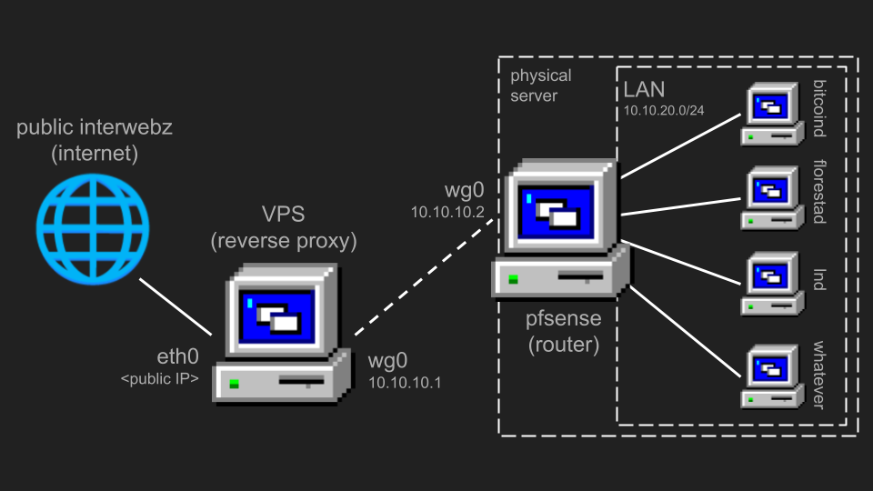

+++
title = "Portable Self-Hosting"
description = "A guide on self-hosting stuff from wherever"
date = "2025-01-27"
template = "blog/blog.html"
+++

# Portable Self-Hosting

This is a guide on self-hosting publicly accessible stuff on your own hardware, from your own home; because
_not your hardware, not your data_. This is an extended version of the
[workshop](https://x.com/ClubeBitcoinUnB/status/1882250321029980236) I gave at
[Clube Bitcoin UnB](https://x.com/ClubeBitcoinUnB).

# Why you should host your own services

As stated above, _not your hardware, not your data_. People in general have become too used
to uploading whatever to some cloud, not knowing that this cloud is just someone else's
computer (and who knows what this "else" does with the data you give away).

If you plan to use Bitcoin in a private and sovereign manner, this is even more important.
You should run your own node–which is your interface to the Bitcoin network–to verify and
broadcast transactions. If you want to use the Lightning Network in a trustless manner,
you should run your node on your hardware; if you run it on a VPS anyone with root access
can snatch away your funds. Leaving the realest money there is on a hot-wallet connected
to the internet is not very safe, especially if you don't own the hardware it's on.

# Network Topology

This is what the network will look like:



We'll use a VPS as a reverse proxy[^proxy] to your server. It will close a VPN tunnel to the pfSense
router, securely routing our traffic over the wire.

[^proxy]:
    A proxy is basically a middleman between your server and the rest of the internet. Requests
    are sent to your proxy and then forwarded to you.

To keep the setup compact, everything is virtualized using Proxmox (yes, even pfSense). You just plug
your server in anywhere and it magically works.

Ideally, the physical server should have two network interfaces: one for the WAN and another for management,
or if you wan't to connect other devices to this network[*interface].

[*interface]:
    If your serve has only one NIC, buy a USB to RJ45 adapter and configure it as the
    other interface on Proxmox.

# Bill of Materials

| Item | Quantity | Price |
| --- | --- | --- |
| Server with 2 NICs | 1 | / |
| VPS | 1 | ~5 USD/mo |

# VPS Hardening

Disable SSH password authentication (password auth is a shitcoin), and ideally use hardware-based auth:
```shell
~$ vim /etc/ssh/sshd_config

PasswordAuthentication no
```

Install `ufw`:
```shell
~$ apt install ufw
```
Later, open the ports necessary to run what you want (eg: 8333 for bitcoind,
9735 for lightning and 50002 for SSL electrum).

# VPS Setup

The VPS will serve as a the VPN server, and pfSense will serve as the VPN client, since the client
can be behind CG-NAT and it's IP can change. The client will **always** initiate the connection.

Install wireguard:
```shell
~$ apt install wireguard
```

Generate two key pairs, one for server and one for client:
```shell
~$ wg genkey | tee server-priv | wg pubkey > server-pub

~$ wg genkey | tee client-priv | wg pubkey > client-pub
```

Now, create `wg0.conf`:
```shell
~$ vim /etc/wireguard/wg0.conf

# VPS
[Interface]
# servers wg0 address
Address = 10.10.10.1/24
ListenPort = 51820
PrivateKey = <server-priv>

# enables multiple clients to talk to each other and reach the LAN
PostUp = iptables -A FORWARD -i wg0 -j ACCEPT; iptables -t nat -A POSTROUTING -o eth0 -j MASQUERADE
PostDown = iptables -D FORWARD -i wg0 -j ACCEPT; iptables -t nat -D POSTROUTING -o eth0 -j MASQUERADE

# pfSense
[Peer]
PublicKey = <client-pub>
# allow packets from pfSense and from LAN
AllowedIPs = 10.10.20.2/32, 10.10.10.0/24

# create more keys, add more peers
```

Now, enable the new interface:
```shell
~$ wg-quick up wg0
```

# Server Setup

First, we need to define what our Wireguard and LAN networks will be. Here, we'll use `10.10.10.0/24`
for Wireguard and `10.10.20.0/24` for LAN.

Install Promxmox, then go to Datacenter > Proxmox > System > Network.
On `vmbr0`, put `10.10.20.100/24` as CIDR, and `10.10.20.1` as Gateway.
Also create a new network bridge `vmbr1` and connect a physical port to it
(this will be the WAN bridge, and `vmbr0` will be the LAN bridge)[*mtu].

[*mtu]:
    **Note**: when creating new VMs and LXCs, set the MTU to 1300. That's because with the default
    value of 1500 + the Wireguard overhead, packets can be dropped because they are too big.


# pfSense Setup

Now, install pfSense as a VM. Follow
[this Mullvad blog post](https://mullvad.net/en/help/pfsense-with-wireguard),
then come back here.

After you're done, all traffic should be routed through the tunnel and out the VPS.
Test this via:
```shell
~$ curl ipinfo.io
{
  "ip": "< >",
  "hostname": "< >>",
  "city": "< >",
  "region": "< >",
  "country": "< >",
  "loc": "< >>",
  "org": "< >>",
  "postal": "< >",
  "timezone": "< >",
  "readme": "https://ipinfo.io/missingauth"
}
```
You should be seeing your VPS's IP information.

# Reverse proxy

To proxy requests, we'll use `nginx`.

```shell
~$ apt install nginx
```

To proxy HTTP traffic to `10.10.20.11`:
```diff
~$ vim /etc/nginx/conf.d/default.conf

+ server {
+   listen 80;
+   proxy_pass http://10.10.20.11:80;
+ }
```

If you want to proxy raw TCP streams:
```diff
~$ vim /etc/nginx/nginx.conf

+ stream {
+   include /etc/nginx/conf.d/*.streamconf
+ }
```

Let's say you want to proxy Bitcoin P2P and LND P2P traffic,
both to `10.10.20.17`:

```diff
~$ ufw allow 8333
~$ ufw allow 9735

~$ /etc/nginx/conf.d/default.streamconf

+ server {
+   listen 8333;
+   proxy_pass 10.10.20.17:8333;
+ }
+
+ server {
+   listen 9735;
+   proxy_pass 10.10.20.17:9735;
+ }
```

You should now be able to hit your public IP and be served content from your local network.

If the resource you want to access is meant to be private, like a password
manager of file server, you should add a new Wireguard client and
access it directly, without doing any reverse proxying. Never make things like these public.

If you're feeling fancy, segregate public and private services on different
LANs. This would imply creating `vmbr2` and adjusting pfSense and the VPS
routing configuration accordingly.

# Conclusion

Now, you should be able to plug the server anywhere, and everything should magically work.
